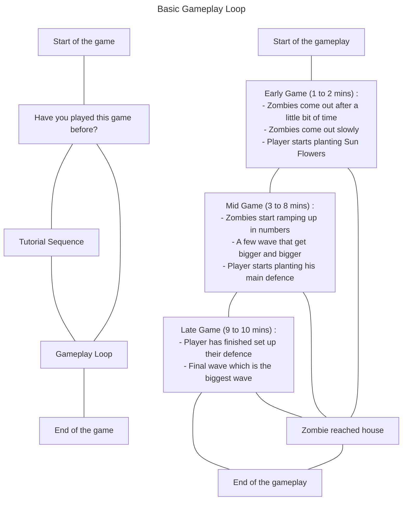

# This contains the flowchart of the gameplay loop

#### The flow chart will be done using the mermaid extension

#### Here are a few extensions that are needed:

```
- Markdown Preview Mermaid Support
- Marmaid Markdown Syntax
- Flowchart
- Live Share
```

